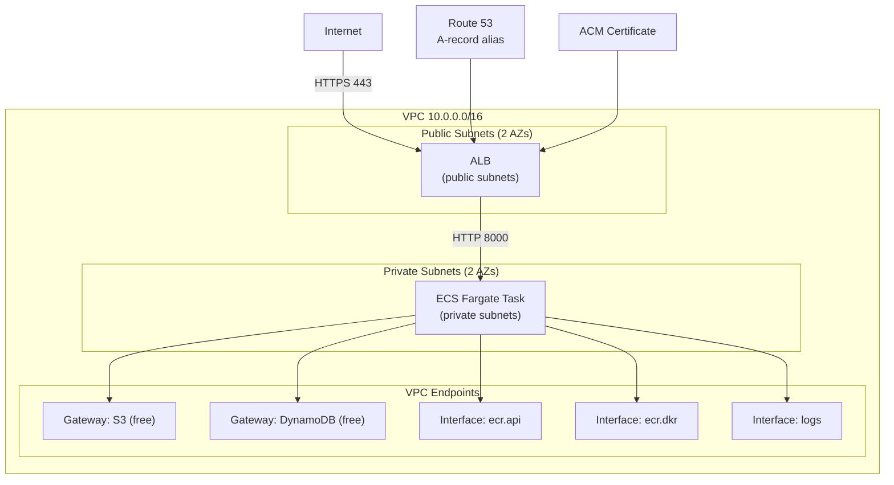
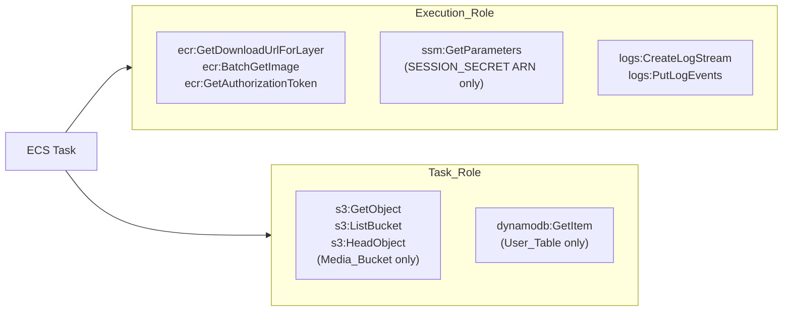
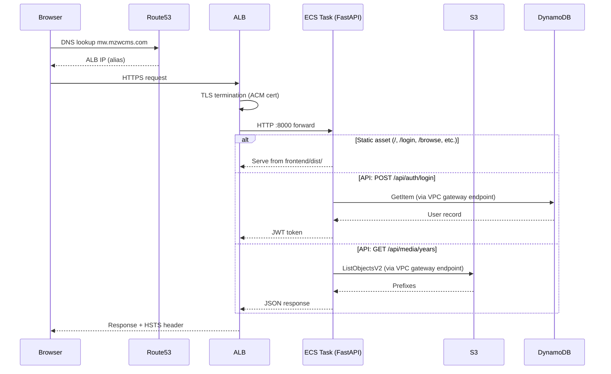

# Design Document: AWS Infrastructure Security Hardening

## Overview

This design deploys the existing FastAPI + React media viewer to AWS ECS Fargate behind an ALB with HTTPS, using CloudFormation as the IaC tool. The architecture follows a zero-trust, least-privilege model: the container runs in private subnets with no internet egress (no NAT gateway), all AWS API traffic flows through VPC endpoints, and every IAM policy is scoped to the exact resource ARN and minimum actions needed.

The application serves a built React SPA as static files from FastAPI, so there is a single container image and a single ECS task. The frontend uses relative `/api` paths, meaning CORS only matters if a separate origin (e.g., a future React Native TV app's web view or a local dev server) makes requests. In production, same-origin requests from the SPA don't trigger CORS at all — but we lock it down anyway as defense-in-depth.

Key design decisions:
- **CloudFormation over Terraform**: AWS-native, no state file management, tighter integration with ACM DNS validation and ECS.
- **No NAT gateway**: Saves ~$32/month. All AWS API calls route through VPC endpoints. The container has no internet access, which is a security benefit.
- **SSM Parameter Store SecureString over Secrets Manager**: Saves $0.40/month/secret. ECS natively supports injecting SSM parameters into container env vars.
- **Single CloudFormation stack**: All resources in one stack for simplicity. No cross-stack references needed at this scale.
- **Smallest Fargate size (0.25 vCPU / 0.5 GB)**: Right-sized for zero customers. The Dockerfile uses `python:3.12-slim` which needs `build-essential` for bcrypt's C extension — this adds ~100MB to the image but is a one-time build cost.

### Dockerfile Fix

The current Dockerfile uses `python:3.12-slim` but does not install `build-essential`. bcrypt requires compiling C extensions. The fix:

```dockerfile
RUN apt-get update && apt-get install -y --no-install-recommends build-essential \
    && pip install --no-cache-dir -r requirements.txt \
    && apt-get purge -y build-essential && apt-get autoremove -y && rm -rf /var/lib/apt/lists/*
```

This installs build tools, compiles bcrypt, then removes them to keep the final layer small.

## Architecture

### Network Topology



### IAM Role Relationships



### Request Flow




## Components and Interfaces

### 1. CloudFormation Stack Structure

A single stack (`media-viewer-prod`) with the following logical resource groups:

| Resource Group | Resources | Notes |
|---|---|---|
| Network | VPC, 2 public subnets, 2 private subnets, IGW, route tables, VPC endpoints | 2 AZs required by ALB |
| Security Groups | ALB SG (443/80 inbound from 0.0.0.0/0), ECS SG (8000 inbound from ALB SG only), VPC Endpoint SG (443 inbound from ECS SG) | |
| Load Balancer | ALB, HTTPS listener (443), HTTP listener (80→redirect), target group | Health check: GET /health, interval 30s, 3 unhealthy threshold |
| DNS/TLS | ACM certificate, Route 53 A-record alias, DNS validation record | Certificate for `mw.mzwcms.com`, must be in same region as ALB. Hosted zone for `mzwcms.com` already exists (domain registered via Route 53). |
| ECS | Cluster, service (desired=1), task definition, ECR repository | Fargate 0.25 vCPU / 0.5 GB |
| IAM | Task_Role, Execution_Role, inline policies | No IAM users or access keys |
| Storage Config | S3 bucket policy, Block Public Access config | Bucket already exists — policy applied via CloudFormation |
| DynamoDB Config | PITR enablement, encryption config | Table already exists — config applied via CloudFormation |
| Secrets | SSM Parameter Store SecureString for SESSION_SECRET | Injected into container env at task startup |
| Logging | CloudWatch log group (30-day retention) | awslogs driver in task definition |

### 2. VPC Endpoints Detail

| Endpoint | Type | Cost | Purpose |
|---|---|---|---|
| `com.amazonaws.{region}.s3` | Gateway | Free | S3 API calls (list, get, head, presign) |
| `com.amazonaws.{region}.dynamodb` | Gateway | Free | DynamoDB GetItem |
| `com.amazonaws.{region}.ecr.api` | Interface | ~$7.30/mo | ECR API (auth token, image manifest) |
| `com.amazonaws.{region}.ecr.dkr` | Interface | ~$7.30/mo | ECR Docker pull |
| `com.amazonaws.{region}.secretsmanager` | Interface | ~$7.30/mo | SSM/Secrets Manager parameter fetch at task start |
| `com.amazonaws.{region}.logs` | Interface | ~$7.30/mo | CloudWatch log shipping |

**Cost note**: Interface endpoints cost ~$7.30/mo each (2 AZs × $0.01/hr × 730 hrs). Four interface endpoints = ~$29.20/mo. This is comparable to a NAT gateway ($32/mo + data) but provides better security (no internet egress at all). If cost is a concern, the Secrets Manager endpoint could be replaced by baking the secret into the task definition from SSM at deploy time (ECS resolves SSM references at task launch, which uses the ECS control plane, not the container's network path). However, keeping the endpoint is safer for secret rotation scenarios.

**Optimization**: Use SSM Parameter Store instead of Secrets Manager. ECS resolves `ssm` parameter references via the ECS control plane during task launch — this happens outside the task's VPC network path. This means we may not need the `secretsmanager` interface endpoint at all if we use SSM. We'll use SSM and include the Secrets Manager endpoint only if needed. Actually, ECS `valueFrom` with SSM uses the ECS agent which runs on AWS infrastructure, so the SSM resolution happens before the container starts and doesn't need a VPC endpoint. We can drop the Secrets Manager interface endpoint entirely.

**Revised endpoint list** (3 interface endpoints = ~$21.90/mo):
- Gateway: S3, DynamoDB (free)
- Interface: ecr.api, ecr.dkr, logs

### 3. Security Groups

```
ALB Security Group:
  Inbound:  TCP 443 from 0.0.0.0/0 (HTTPS)
            TCP 80  from 0.0.0.0/0 (HTTP redirect)
  Outbound: TCP 8000 to ECS SG

ECS Security Group:
  Inbound:  TCP 8000 from ALB SG
  Outbound: TCP 443 to VPC Endpoint SG (for ECR, CloudWatch)
            (S3/DynamoDB gateway endpoints use route table, no SG rule needed)

VPC Endpoint Security Group:
  Inbound:  TCP 443 from ECS SG
```

### 4. Application Code Changes

#### 4a. CORS Lockdown (`app/main.py`)

Current code uses `allow_origins=["*"]`. Change to:

```python
settings = get_settings()
origins = [o.strip() for o in settings.CORS_ALLOWED_ORIGINS.split(",") if o.strip()]

app.add_middleware(
    CORSMiddleware,
    allow_origins=origins,
    allow_credentials=True,
    allow_methods=["*"],
    allow_headers=["*"],
)
```

Add `CORS_ALLOWED_ORIGINS` to `Settings`:
```python
CORS_ALLOWED_ORIGINS: str = "http://localhost:5173"  # default for local dev
```

In production, set `CORS_ALLOWED_ORIGINS=https://mw.mzwcms.com` in the ECS task definition environment.

#### 4b. HSTS Middleware (`app/main.py`)

Add after CORS middleware:

```python
from starlette.middleware.base import BaseHTTPMiddleware
from starlette.requests import Request
from starlette.responses import Response

class HSTSMiddleware(BaseHTTPMiddleware):
    async def dispatch(self, request: Request, call_next):
        response = await call_next(request)
        response.headers["Strict-Transport-Security"] = "max-age=31536000; includeSubDomains"
        return response

app.add_middleware(HSTSMiddleware)
```

#### 4c. boto3 Client Caching (`app/api/s3/client.py`)

Current `_get_s3_client()` creates a new client on every call. Change to module-level singleton:

```python
from functools import lru_cache

@lru_cache(maxsize=1)
def _get_s3_client():
    settings = get_settings()
    return boto3.client("s3", region_name=settings.AWS_REGION)
```

#### 4d. DynamoDB Table Caching (`app/api/auth/models.py`)

Same pattern — current `_get_table()` creates a new resource on every call:

```python
from functools import lru_cache

@lru_cache(maxsize=1)
def _get_table():
    settings = get_settings()
    dynamodb = boto3.resource("dynamodb", region_name=settings.AWS_REGION)
    return dynamodb.Table(settings.DYNAMODB_TABLE_NAME)
```

#### 4e. Settings Caching (`app/api/config/settings.py`)

```python
from functools import lru_cache

@lru_cache(maxsize=1)
def get_settings() -> Settings:
    return Settings()
```

#### 4f. Health Endpoint Client Reuse (`app/api/health/router.py`)

Replace standalone `boto3.client()` calls with shared clients:

```python
from app.api.s3.client import _get_s3_client
from app.api.auth.models import _get_table

@router.get("/health")
def health_check() -> JSONResponse:
    result = {}
    bucket_name = MEDIA_SOURCES["video"].bucket_name
    settings = get_settings()
    
    try:
        _get_s3_client().head_bucket(Bucket=bucket_name)
        result["s3"] = "ok"
    except (ClientError, BotoCoreError):
        result["s3"] = "unreachable"
    
    try:
        _get_table().meta.client.describe_table(
            TableName=settings.DYNAMODB_TABLE_NAME
        )
        result["dynamodb"] = "ok"
    except (ClientError, BotoCoreError):
        result["dynamodb"] = "unreachable"
    
    all_ok = all(v == "ok" for v in result.values())
    return JSONResponse(content=result, status_code=200 if all_ok else 503)
```

### 5. CloudFormation Template Organization

Single template file `infra/template.yaml` with parameters:

| Parameter | Type | Description |
|---|---|---|
| `DomainName` | String | Application domain (`mw.mzwcms.com`) |
| `HostedZoneId` | String | Route 53 hosted zone ID for `mzwcms.com` (already exists — domain registered via Route 53) |
| `ImageUri` | String | ECR image URI (account.dkr.ecr.region.amazonaws.com/repo:tag) |
| `SessionSecretArn` | String | SSM Parameter Store ARN for SESSION_SECRET |
| `AdminPrincipalArn` | String | IAM ARN for admin console/CLI access to S3 bucket |
| `S3BucketName` | String | Default: `mw-family-videos-1` |
| `DynamoDBTableName` | String | Default: `User_Table` |
| `CorsAllowedOrigins` | String | Default: `https://{DomainName}` |

**Note on Route 53 hosted zone**: The domain `mzwcms.com` is registered via Route 53, so the hosted zone already exists. The CloudFormation template references this existing hosted zone (via the `HostedZoneId` parameter) rather than creating a new one. The ACM certificate for `mw.mzwcms.com` uses DNS validation records written to this same hosted zone, and the A-record alias (`mw.mzwcms.com` → ALB) is created within it.


## Data Models

### IAM Policy Documents

#### Task_Role Policy

```json
{
  "Version": "2012-10-17",
  "Statement": [
    {
      "Sid": "S3ReadMedia",
      "Effect": "Allow",
      "Action": [
        "s3:GetObject",
        "s3:ListBucket",
        "s3:HeadObject"
      ],
      "Resource": [
        "arn:aws:s3:::mw-family-videos-1",
        "arn:aws:s3:::mw-family-videos-1/*"
      ]
    },
    {
      "Sid": "DynamoDBReadUser",
      "Effect": "Allow",
      "Action": "dynamodb:GetItem",
      "Resource": "arn:aws:dynamodb:{region}:{account}:table/User_Table"
    }
  ]
}
```

#### Execution_Role Policy

```json
{
  "Version": "2012-10-17",
  "Statement": [
    {
      "Sid": "ECRPull",
      "Effect": "Allow",
      "Action": [
        "ecr:GetDownloadUrlForLayer",
        "ecr:BatchGetImage",
        "ecr:GetAuthorizationToken"
      ],
      "Resource": "*"
    },
    {
      "Sid": "SSMReadSecret",
      "Effect": "Allow",
      "Action": "ssm:GetParameters",
      "Resource": "arn:aws:ssm:{region}:{account}:parameter/media-viewer/SESSION_SECRET"
    },
    {
      "Sid": "CloudWatchLogs",
      "Effect": "Allow",
      "Action": [
        "logs:CreateLogStream",
        "logs:PutLogEvents"
      ],
      "Resource": "arn:aws:logs:{region}:{account}:log-group:/ecs/media-viewer:*"
    }
  ]
}
```

#### S3 Bucket Policy

```json
{
  "Version": "2012-10-17",
  "Statement": [
    {
      "Sid": "DenyAllExceptAllowed",
      "Effect": "Deny",
      "Principal": "*",
      "Action": "s3:*",
      "Resource": [
        "arn:aws:s3:::mw-family-videos-1",
        "arn:aws:s3:::mw-family-videos-1/*"
      ],
      "Condition": {
        "StringNotEquals": {
          "aws:PrincipalArn": [
            "{Task_Role_ARN}",
            "{Admin_Principal_ARN}"
          ]
        }
      }
    }
  ]
}
```

### ECS Task Definition (Key Fields)

```json
{
  "family": "media-viewer",
  "networkMode": "awsvpc",
  "requiresCompatibilities": ["FARGATE"],
  "cpu": "256",
  "memory": "512",
  "executionRoleArn": "{Execution_Role_ARN}",
  "taskRoleArn": "{Task_Role_ARN}",
  "containerDefinitions": [
    {
      "name": "media-viewer",
      "image": "{ECR_IMAGE_URI}",
      "portMappings": [{ "containerPort": 8000, "protocol": "tcp" }],
      "environment": [
        { "name": "S3_BUCKET_NAME", "value": "mw-family-videos-1" },
        { "name": "AWS_REGION", "value": "us-east-1" },
        { "name": "DYNAMODB_TABLE_NAME", "value": "User_Table" },
        { "name": "CORS_ALLOWED_ORIGINS", "value": "https://mw.mzwcms.com" }
      ],
      "secrets": [
        {
          "name": "SESSION_SECRET",
          "valueFrom": "arn:aws:ssm:{region}:{account}:parameter/media-viewer/SESSION_SECRET"
        }
      ],
      "logConfiguration": {
        "logDriver": "awslogs",
        "options": {
          "awslogs-group": "/ecs/media-viewer",
          "awslogs-region": "us-east-1",
          "awslogs-stream-prefix": "ecs"
        }
      }
    }
  ]
}
```

### ECR Lifecycle Policy

```json
{
  "rules": [
    {
      "rulePriority": 1,
      "description": "Keep only 5 most recent images",
      "selection": {
        "tagStatus": "any",
        "countType": "imageCountMoreThan",
        "countNumber": 5
      },
      "action": { "type": "expire" }
    }
  ]
}
```

### CloudWatch Log Group

- Name: `/ecs/media-viewer`
- Retention: 30 days

### DynamoDB Table Configuration

- Table: `User_Table` (already exists)
- Billing: PAY_PER_REQUEST (already configured)
- Point-in-time recovery: enabled (new)
- Encryption: AWS-owned key (default, already configured)

### S3 Bucket Configuration

- Bucket: `mw-family-videos-1` (already exists)
- Block Public Access: all four settings = true (new)
- Default encryption: SSE-S3 (AES-256) (new)
- Bucket policy: deny-all-except Task_Role and Admin_Principal (new)

### Settings Model Addition

```python
class Settings(BaseSettings):
    S3_BUCKET_NAME: str = "mw-family-videos-1"
    AWS_REGION: str = "us-east-1"
    SESSION_SECRET: str
    DYNAMODB_TABLE_NAME: str = "User_Table"
    CORS_ALLOWED_ORIGINS: str = "http://localhost:5173"  # comma-separated
```


## Correctness Properties

*A property is a characteristic or behavior that should hold true across all valid executions of a system — essentially, a formal statement about what the system should do. Properties serve as the bridge between human-readable specifications and machine-verifiable correctness guarantees.*

### Property 1: HSTS header present on all responses

*For any* HTTP request path to the FastAPI application, the response SHALL contain a `Strict-Transport-Security` header with a `max-age` value of at least 31536000.

**Validates: Requirements 2.5**

### Property 2: Task_Role S3 permissions are exactly the read set

*For any* S3 action present in the Task_Role IAM policy, that action SHALL be one of `s3:GetObject`, `s3:ListBucket`, or `s3:HeadObject` — and no other S3 actions SHALL appear.

**Validates: Requirements 3.3, 3.4**

### Property 3: Task_Role DynamoDB permissions are exactly GetItem

*For any* DynamoDB action present in the Task_Role IAM policy, that action SHALL be exactly `dynamodb:GetItem` — and no other DynamoDB actions SHALL appear.

**Validates: Requirements 4.1, 4.2**

### Property 4: DynamoDB resource ARN is not a wildcard

*For any* DynamoDB statement in the Task_Role IAM policy, the `Resource` field SHALL be a specific table ARN (containing `table/User_Table`), not `*` or a wildcard pattern.

**Validates: Requirements 4.3**

### Property 5: CORS rejects non-allowed origins

*For any* HTTP request with an `Origin` header value that is not in the configured `CORS_ALLOWED_ORIGINS` list, the response SHALL NOT contain an `Access-Control-Allow-Origin` header.

**Validates: Requirements 5.1, 5.2, 5.4**

### Property 6: Execution_Role SSM access scoped to exact parameter ARN

*For any* SSM action in the Execution_Role IAM policy, the `Resource` field SHALL reference the exact SSM parameter ARN for SESSION_SECRET, not a wildcard.

**Validates: Requirements 6.3**

### Property 7: Task_Role has no secrets access

*For any* statement in the Task_Role IAM policy, no action SHALL match `ssm:*`, `secretsmanager:*`, or any secrets-related permission.

**Validates: Requirements 6.4**

### Property 8: No IAM users or access keys in CloudFormation template

*For any* resource in the CloudFormation template, the resource type SHALL NOT be `AWS::IAM::User` or `AWS::IAM::AccessKey`.

**Validates: Requirements 7.3**

### Property 9: No explicit AWS credentials in boto3 client creation

*For any* call to `boto3.client()` or `boto3.resource()` in the application codebase, the call SHALL NOT pass `aws_access_key_id` or `aws_secret_access_key` as arguments.

**Validates: Requirements 7.5**

### Property 10: No NAT gateways in CloudFormation template

*For any* resource in the CloudFormation template, the resource type SHALL NOT be `AWS::EC2::NatGateway`.

**Validates: Requirements 10.4**

### Property 11: Singleton caching for all factory functions

*For any* of the factory functions (`_get_s3_client`, `_get_table`, `get_settings`), calling the function N times (N ≥ 2) SHALL return the exact same object instance (identity equality) every time.

**Validates: Requirements 11.1, 11.2, 11.3, 11.7**


## Error Handling

### Infrastructure Provisioning Errors

| Scenario | Behavior |
|---|---|
| ACM certificate DNS validation fails | Stack creation pauses at certificate resource; timeout after 72 hours. User must verify Route 53 hosted zone is correct. |
| ECR image not found at deploy time | ECS task fails to start; Execution_Role logs error to CloudWatch. Service retries with backoff. |
| SSM parameter missing at task startup | ECS refuses to launch the task container. Failure visible in ECS service events and CloudWatch. |
| VPC endpoint creation fails | Stack rolls back. All interface endpoints require the VPC endpoint SG to allow TCP 443 from ECS SG. |
| S3 bucket policy conflicts with existing policy | CloudFormation update fails. Existing bucket policy must be removed or merged manually before stack deploy. |

### Application Runtime Errors

| Scenario | Behavior |
|---|---|
| S3 unreachable (VPC endpoint down) | Health endpoint returns `{"s3": "unreachable"}` with 503. ALB marks task unhealthy after 3 failures. ECS replaces task. |
| DynamoDB unreachable | Health endpoint returns `{"dynamodb": "unreachable"}` with 503. Same ALB/ECS replacement flow. |
| SESSION_SECRET env var empty/missing | FastAPI startup fails (pydantic validation error, `SESSION_SECRET` has no default). Container exits, ECS replaces. |
| CORS_ALLOWED_ORIGINS env var missing | Falls back to default `http://localhost:5173`. In production this means CORS blocks all browser requests from the real domain — visible as 403-like behavior in browser console. |
| boto3 credential resolution fails | All AWS API calls raise `NoCredentialsError`. Health check fails, ALB marks unhealthy, ECS replaces. |
| bcrypt import fails (missing C extension) | FastAPI fails to import auth router at startup. Container exits immediately. Fix: ensure `build-essential` in Dockerfile. |

### Deployment Errors

| Scenario | Behavior |
|---|---|
| Dockerfile bcrypt build failure | `pip install` fails during `docker build`. Fix: install `build-essential` before pip install, remove after. |
| CloudFormation stack update fails mid-deploy | Automatic rollback to previous stable state. ECS service continues running previous task definition. |
| ECR push without authentication | `docker push` fails with 401. Fix: run `aws ecr get-login-password | docker login`. |

## Testing Strategy

### Property-Based Testing

Library: **Hypothesis** (already in `requirements.txt`)

Each correctness property maps to a single Hypothesis test. Minimum 100 examples per test (Hypothesis default is 100, which satisfies this).

Each test is tagged with a comment referencing the design property:
```python
# Feature: aws-infra-security-hardening, Property 1: HSTS header present on all responses
```

#### Property Test Plan

| Property | Test Approach | Generator |
|---|---|---|
| P1: HSTS header | Use FastAPI `TestClient`, generate random valid URL paths, assert `Strict-Transport-Security` header present with correct max-age | `st.text()` filtered to valid URL path characters |
| P2: Task_Role S3 actions | Parse IAM policy JSON, extract all S3 actions, assert set equality with `{GetObject, ListBucket, HeadObject}` | Generate random IAM policy documents with varying S3 actions, verify the validator rejects non-conforming ones |
| P3: Task_Role DynamoDB actions | Parse IAM policy JSON, extract DynamoDB actions, assert set is exactly `{GetItem}` | Same approach as P2 for DynamoDB actions |
| P4: DynamoDB resource ARN not wildcard | Parse IAM policy, extract DynamoDB statement resources, assert none are `*` and all contain `table/User_Table` | Generate random ARN strings and wildcards, verify validator accepts only specific ARNs |
| P5: CORS rejects non-allowed origins | Use FastAPI `TestClient`, send requests with random `Origin` headers not matching allowed origin, assert no `Access-Control-Allow-Origin` in response | `st.text()` for random origin strings, excluding the configured allowed origin |
| P6: Execution_Role SSM scoped | Parse policy, verify SSM resource is exact ARN | Generate random SSM ARN patterns, verify validator rejects wildcards |
| P7: Task_Role no secrets access | Parse Task_Role policy, assert no SSM or Secrets Manager actions | Generate random policy documents, verify validator catches secrets actions |
| P8: No IAM users in template | Parse CloudFormation JSON/YAML, scan resource types | Generate random CloudFormation resource type strings, verify scanner catches IAM::User and IAM::AccessKey |
| P9: No explicit credentials | AST-parse Python source files, find boto3.client/resource calls, assert no credential kwargs | Generate random boto3 call signatures, verify scanner catches explicit credentials |
| P10: No NAT gateways | Parse CloudFormation, scan resource types for NatGateway | Same approach as P8 |
| P11: Singleton caching | Call each factory function N times, assert all return values are `is`-identical | `st.integers(min_value=2, max_value=50)` for N |

### Unit Testing

Unit tests complement property tests by covering specific examples, edge cases, and integration points:

| Area | Tests |
|---|---|
| HSTS middleware | Verify exact header value `max-age=31536000; includeSubDomains` on a known endpoint |
| CORS | Verify allowed origin gets `Access-Control-Allow-Origin`, verify `*` origin is rejected, verify empty `CORS_ALLOWED_ORIGINS` env var behavior |
| Settings caching | Verify `get_settings()` returns same instance, verify settings reads from env vars correctly |
| S3 client caching | Verify `_get_s3_client()` returns same client object on second call |
| DynamoDB table caching | Verify `_get_table()` returns same table object on second call |
| Health endpoint | Verify uses shared clients (mock boto3, assert no new client creation), verify 200 on healthy, 503 on unhealthy |
| CloudFormation template validation | `aws cloudformation validate-template` against the template file |
| IAM policy structure | Verify Task_Role policy has exactly the expected statements, no more |
| Dockerfile | Verify `.env` not copied, verify `build-essential` installed and removed |

### Test Configuration

- Property tests: Hypothesis with `@settings(max_examples=100)` minimum
- Unit tests: pytest with moto for AWS service mocking
- All tests run via `pytest tests/` (no watch mode)
- Property tests in `tests/property/`, unit tests in `tests/unit/`

