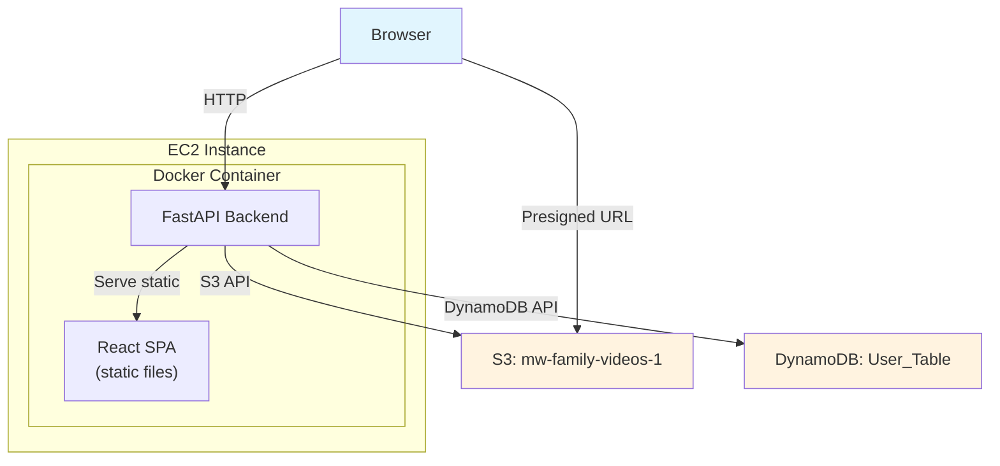
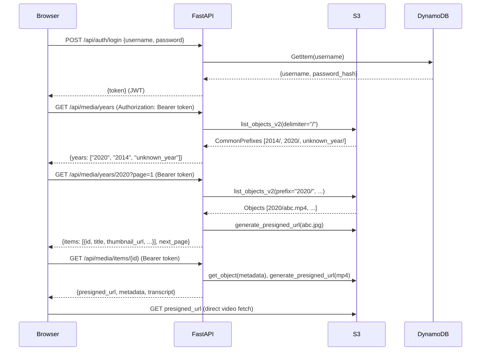

# Design Document: Family Media Viewer

## Overview

A single-page application for browsing and playing a family's S3-stored video collection. The system consists of a React frontend served by a FastAPI backend, packaged in one Docker image for deployment on a single EC2 instance. The backend acts as a thin proxy over S3 and DynamoDB — it lists objects, generates presigned URLs, reads metadata/transcript files, and authenticates ~20 users. There is no application database beyond DynamoDB for auth; all media data lives in S3.

The architecture is designed so that adding image support later means adding a config entry and a viewer component, not restructuring the backend.

### Key Design Decisions

1. **No media database / no indexing layer.** With ~5600 files and ~20 users, S3 `list_objects_v2` with prefix filtering is sufficient. A caching layer (in-memory TTL cache) absorbs repeated listing calls. This avoids DynamoDB cost and sync complexity for media metadata.

2. **Presigned URLs for all S3 content.** The backend never streams bytes. Thumbnails, videos, and future images are all served via presigned URLs. This keeps the backend stateless and CPU-light.

3. **Session tokens as signed JWTs.** No server-side session store. The JWT contains the username and expiry. The backend validates the signature on each request. This is acceptable for ~20 users with no revocation requirement beyond token expiry.

4. **`url` field preserved, presigned URL served separately.** The metadata `url` field contains the original YouTube URL. The API response includes this as-is and adds a `presigned_url` field for S3 playback. No field overwriting.

5. **Multi-bucket config from day one.** The backend reads a config mapping `media_type → {bucket, extensions, patterns}`. At launch only `video` is configured, but the routing and S3 access layer are generic over this config.

## Architecture



### Request Flow



## Components and Interfaces

### Backend Components

#### 1. Auth Module (`api/auth/`)

- **POST /api/auth/login** — Accepts `{username, password}`, verifies against DynamoDB bcrypt hash, returns JWT.
- **POST /api/auth/logout** — Client-side only (JWT is stateless). Included for API completeness; returns 200.
- **Auth dependency** — FastAPI dependency that extracts and validates the JWT from the `Authorization: Bearer` header on all `/api/media/*` routes.
- **CLI: create-user** — A CLI command (`python -m app.cli create-user <username> <password>`) that writes a bcrypt-hashed record to DynamoDB.

#### 2. Media Listing Module (`api/media/`)

- **GET /api/media/years** — Lists year folder prefixes from the configured bucket. Returns sorted list (reverse chronological, `unknown_year` last).
- **GET /api/media/years/{year}?page=N&page_size=M&sort=date&type=video** — Paginated listing of media items in a year folder. Returns items with thumbnail presigned URLs. `sort` only accepts `date` at launch; invalid values return 400. `type` filters by media type; defaults to all.
- **GET /api/media/items/{id}** — Full detail for a single media item: presigned URL for playback, metadata attributes, transcript content (if available), thumbnail presigned URL.
- **PATCH /api/media/items/{id}/metadata** — Stub endpoint. Validates that body contains a `description` string field, then returns 501.

#### 3. Config Module (`api/config/`)

- Reads media source configuration: a dict mapping `media_type` to `{bucket_name, file_extension, metadata_suffix, thumbnail_suffix, transcript_suffix (optional)}`.
- At launch: `{"video": {"bucket_name": "mw-family-videos-1", "file_extension": ".mp4", "metadata_suffix": ".mp4.metadata.json", "thumbnail_suffix": ".jpg", "transcript_suffix": ".md"}}`.

#### 4. S3 Access Layer (`api/s3/`)

- Generic over media type config. Given a bucket name and prefix, lists objects, generates presigned URLs, reads object content.
- In-memory TTL cache (60s) for year listing and per-year item listings. Cache is invalidated on TTL expiry only — acceptable for a read-only app with infrequent uploads.

#### 5. Health Module (`api/health/`)

- **GET /health** — Checks S3 `head_bucket` and DynamoDB `describe_table`. Returns 200 with `{"s3": "ok", "dynamodb": "ok"}` or 503 with details on which dependency failed.

### Frontend Components

#### 1. Auth Pages
- Login form. Stores JWT in memory (not localStorage — tab-scoped session). Redirects to login on 401 or missing token.

#### 2. Year Browser
- Fetches `/api/media/years`, renders year groups. Each group expands to a thumbnail grid via `/api/media/years/{year}`.

#### 3. Thumbnail Grid
- Renders media items as a grid of thumbnail images. Placeholder SVG when no thumbnail exists. Click navigates to detail view.

#### 4. Media Detail View
- Video player (HTML5 `<video>` with presigned URL `src`), transcript panel (rendered markdown), metadata panel.
- Disabled "Edit Description" button with tooltip explaining future availability.
- Presigned URL refresh: if playback fails with a 403 from S3, re-fetches the detail endpoint for a fresh URL.

#### 5. Sort & Filter Controls
- Media type tabs: "Video" enabled, others disabled with "coming soon" tooltip.
- Sort dropdown: "By Date" enabled, others disabled with "coming soon" tooltip.

### API Response Shapes

**Media Item (list context):**
```json
{
  "id": "L_G1-L6TvOs",
  "title": "The Day The Chip Conveyor Quit",
  "year": "2026",
  "upload_date": "20260220",
  "media_type": "video",
  "thumbnail_url": "https://s3...presigned...",
  "has_thumbnail": true
}
```

**Media Item (detail context):**
```json
{
  "id": "L_G1-L6TvOs",
  "title": "The Day The Chip Conveyor Quit",
  "year": "2026",
  "media_type": "video",
  "presigned_url": "https://s3...presigned-mp4...",
  "thumbnail_url": "https://s3...presigned-jpg...",
  "metadata": {
    "video_id": "L_G1-L6TvOs",
    "title": "The Day The Chip Conveyor Quit",
    "url": "https://www.youtube.com/watch?v=L_G1-L6TvOs",
    "upload_date": "20260220",
    "playlists": "Chuck's corner",
    "transcript_language": "en",
    "processed_timestamp": "2026-02-25T00:39:23.814345Z",
    "description": "a description"
  },
  "transcript": "## Transcript\n\nHello everyone...",
  "transcript_available": true
}
```


## Data Models

### DynamoDB: User_Table

| Attribute | Type | Description |
|-----------|------|-------------|
| `username` | String (PK) | Unique username |
| `password_hash` | String | bcrypt hash of the password |

No sort key. Simple key-value lookup by username.

### Media Source Config (in-app, not persisted)

```python
@dataclass
class MediaSourceConfig:
    bucket_name: str
    file_extension: str        # e.g. ".mp4"
    metadata_suffix: str       # e.g. ".mp4.metadata.json"
    thumbnail_suffix: str      # e.g. ".jpg"
    transcript_suffix: str | None  # e.g. ".md", None if not applicable

# Loaded from environment or config file
MEDIA_SOURCES: dict[str, MediaSourceConfig] = {
    "video": MediaSourceConfig(
        bucket_name="mw-family-videos-1",
        file_extension=".mp4",
        metadata_suffix=".mp4.metadata.json",
        thumbnail_suffix=".jpg",
        transcript_suffix=".md",
    )
}
```

### Metadata File Schema (S3, Bedrock KB format)

The metadata file is a JSON file stored at `{year}/{id}.mp4.metadata.json`:

```json
{
  "metadataAttributes": {
    "video_id": "string",
    "title": "string",
    "url": "string (original YouTube URL)",
    "upload_date": "string (YYYYMMDD)",
    "playlists": "string (comma-separated, optional/empty)",
    "transcript_language": "string (ISO 639-1)",
    "processed_timestamp": "string (ISO 8601)",
    "description": "string"
  }
}
```

Future additions for the editing stub (Requirement 7.5):
- `last_modified_by`: string — username of last editor
- `schema_version`: string — version identifier for pipeline compatibility

These fields are not written today but are included in the Pydantic model as optional fields so the schema is forward-compatible.

### Pydantic Models

```python
class MetadataAttributes(BaseModel):
    video_id: str
    title: str
    url: str  # Original YouTube URL, never overwritten
    upload_date: str  # YYYYMMDD
    playlists: str | None = None
    transcript_language: str | None = None
    processed_timestamp: str | None = None
    description: str | None = None
    # Future fields
    last_modified_by: str | None = None
    schema_version: str | None = None

    class Config:
        extra = "allow"  # Preserve unknown fields (Req 6.6)

class MetadataFile(BaseModel):
    metadataAttributes: MetadataAttributes

class MediaItemSummary(BaseModel):
    id: str
    title: str
    year: str
    upload_date: str
    media_type: str
    thumbnail_url: str | None
    has_thumbnail: bool

class MediaItemDetail(BaseModel):
    id: str
    title: str
    year: str
    media_type: str
    presigned_url: str
    thumbnail_url: str | None
    metadata: MetadataAttributes | None
    transcript: str | None
    transcript_available: bool

class MetadataUpdateRequest(BaseModel):
    description: str  # Required for stub validation (Req 7.4)

class YearsResponse(BaseModel):
    years: list[str]

class MediaListResponse(BaseModel):
    items: list[MediaItemSummary]
    page: int
    page_size: int
    total: int
    next_page: int | None
```

### JWT Token Payload

```json
{
  "sub": "username",
  "exp": 1234567890,
  "iat": 1234567890
}
```

Signed with HS256 using the `SESSION_SECRET` environment variable. Expiry: 24 hours.

### S3 Object Layout

```
mw-family-videos-1/
├── 2014/
│   ├── abc123.mp4
│   ├── abc123.mp4.metadata.json
│   ├── abc123.md
│   ├── abc123.jpg
│   └── ...
├── 2020/
│   └── ...
├── unknown_year/
│   └── ...
```

Each video `{id}.mp4` may have up to three companion files:
- `{id}.mp4.metadata.json` — metadata
- `{id}.md` — transcript
- `{id}.jpg` — thumbnail

All four files share the same prefix `{year}/{id}`.

## Correctness Properties

*A property is a characteristic or behavior that should hold true across all valid executions of a system — essentially, a formal statement about what the system should do. Properties serve as the bridge between human-readable specifications and machine-verifiable correctness guarantees.*

### Property 1: Authentication round-trip

*For any* username and password pair, creating a user via the CLI and then logging in with those credentials should return a JWT whose `sub` claim equals the username and whose `exp` claim is in the future.

**Validates: Requirements 1.1, 1.6**

### Property 2: Invalid credentials return uniform error

*For any* credential pair where the username does not exist or the password does not match the stored hash, the login endpoint should return the same error response shape with no indication of which field was incorrect.

**Validates: Requirements 1.2**

### Property 3: Invalid tokens are rejected

*For any* expired JWT, malformed JWT, or arbitrary non-JWT string used as a Bearer token, all protected API endpoints should return a 401 status code.

**Validates: Requirements 1.5**

### Property 4: Year listing sort order

*For any* set of S3 year-folder prefixes (including a possible `unknown_year` prefix), the `/api/media/years` endpoint should return them in reverse chronological order with `unknown_year` appearing last if present.

**Validates: Requirements 2.1, 2.2**

### Property 5: Pagination bounds

*For any* year folder containing N media items, requesting page P with page_size S should return at most S items, a `total` equal to N, and `next_page` set to P+1 when more items exist or null otherwise. All returned items should belong to the requested year folder.

**Validates: Requirements 2.3**

### Property 6: Thumbnail URL conditional inclusion

*For any* media item in a listing response, `has_thumbnail` should be true and `thumbnail_url` should be a non-null presigned URL if and only if a `{id}.jpg` file exists in the same S3 prefix. When no thumbnail file exists, `has_thumbnail` should be false and `thumbnail_url` should be null.

**Validates: Requirements 3.1**

### Property 7: Presigned URL correctness

*For any* media item detail request, the returned `presigned_url` should reference the correct S3 bucket and object key (`{year}/{id}.mp4`), and the URL's expiration parameter should be no greater than 3600 seconds.

**Validates: Requirements 4.1, 4.2**

### Property 8: Missing media returns 404

*For any* media item ID that does not correspond to an existing file in the Media_Bucket, the detail endpoint should return a 404 status code.

**Validates: Requirements 4.5**

### Property 9: Transcript conditional inclusion

*For any* media item detail response, `transcript_available` should be true and `transcript` should be a non-empty string if and only if a `{id}.md` file exists and is readable in the same S3 prefix. When no transcript file exists, `transcript_available` should be false and `transcript` should be null.

**Validates: Requirements 5.1**

### Property 10: Metadata fidelity

*For any* metadata JSON file containing a `metadataAttributes` object (with known fields, unknown extra fields, empty/null `playlists`, and any `upload_date` string), the API detail response should preserve all fields exactly — `upload_date` as the original YYYYMMDD string, `url` as the original YouTube URL (not overwritten by the presigned URL), and all unknown fields included without discarding.

**Validates: Requirements 6.1, 6.4, 6.5, 6.6**

### Property 11: Metadata update stub validation

*For any* request to the metadata update endpoint: if the payload contains a `description` field that is a string, the endpoint should return 501. If the payload is missing `description` or `description` is not a string, the endpoint should return 422.

**Validates: Requirements 7.3, 7.4**

### Property 12: Invalid sort parameter rejection

*For any* sort parameter value that is not `date`, the media listing endpoint should return a 400 status code with a response body that lists the currently supported sort values.

**Validates: Requirements 8.4**

### Property 13: Media source config lookup

*For any* media source configuration mapping and any configured media type key, looking up that key should return the correct bucket name, file extension, metadata suffix, thumbnail suffix, and transcript suffix. Looking up an unconfigured media type should fail gracefully.

**Validates: Requirements 9.1, 9.4**

### Property 14: Environment variable config loading

*For any* set of environment variables (S3 bucket name, AWS region, session secret, DynamoDB table name), the application config module should produce a configuration object whose fields match the provided environment variable values exactly.

**Validates: Requirements 10.2**

## Error Handling

### API Error Response Shape

All API errors use a consistent JSON shape:

```json
{
  "detail": "Human-readable error message"
}
```

FastAPI's default error handling provides this for validation errors (422). Custom exception handlers extend it to other cases.

### Error Matrix

| Condition | Status Code | Detail | Requirement |
|-----------|-------------|--------|-------------|
| Invalid credentials (wrong user or password) | 401 | "Invalid credentials" (no specifics) | 1.2 |
| Missing/expired/malformed Bearer token | 401 | "Authentication required" | 1.5 |
| Media item not found in S3 | 404 | "Media item not found" | 4.5 |
| Invalid sort parameter | 400 | "Unsupported sort value. Supported: date" | 8.4 |
| Metadata update stub (valid payload) | 501 | "Metadata editing not yet implemented" | 7.3 |
| Metadata update stub (invalid payload) | 422 | Pydantic validation error detail | 7.4 |
| S3 unreachable | 503 | "Media storage unavailable" | 2.8 |
| DynamoDB unreachable | 503 | "Authentication service unavailable" | 10.4 |
| Health check partial failure | 503 | `{"s3": "ok\|unreachable", "dynamodb": "ok\|unreachable"}` | 10.3, 10.4 |

### Graceful Degradation

- **Transcript read failure**: The detail endpoint returns the media item without transcript content. `transcript` is null, `transcript_available` is false, and an `errors` array includes `{"field": "transcript", "message": "..."}`. (Req 5.4)
- **Metadata read failure**: The detail endpoint returns the media item with `metadata` set to null. The presigned URL for playback is still generated. (Req 6.3)
- **Thumbnail check failure**: The listing treats the item as having no thumbnail (`has_thumbnail: false`). Playback is unaffected.

### Frontend Error Handling

- **401 from any API call**: Clear stored JWT, redirect to login.
- **403 from S3 presigned URL** (during video playback): Re-fetch the detail endpoint for a fresh presigned URL, retry playback. (Req 4.4)
- **503 from API**: Display a "Service temporarily unavailable" banner. Retry with exponential backoff.
- **404 from detail endpoint**: Display "This media item could not be found" in the detail view.

## Testing Strategy

### Property-Based Testing

Library: **Hypothesis** (Python, for the FastAPI backend)

Each correctness property from the design document is implemented as a single Hypothesis test. Tests are configured with `@settings(max_examples=100)` minimum.

Each test is tagged with a comment referencing the design property:
```python
# Feature: family-media-viewer, Property 1: Authentication round-trip
```

Property tests focus on:
- Input validation boundaries (auth, sort params, metadata payloads)
- Data fidelity (metadata round-trips, field preservation)
- Sort order invariants (year listing)
- Conditional inclusion logic (thumbnails, transcripts)
- Config lookup correctness

Generators needed:
- Usernames and passwords (alphanumeric strings, edge cases with special chars)
- Year folder names (4-digit strings, "unknown_year")
- Metadata JSON objects (known fields + random extra fields)
- Media item IDs (alphanumeric + hyphens + underscores)
- JWT tokens (valid, expired, malformed)
- Sort parameter values (valid and invalid strings)

### Unit Testing

Library: **pytest** (backend), **Vitest** + **React Testing Library** (frontend)

Unit tests cover specific examples, edge cases, and integration points:

- Login with a known valid user returns 200 and a JWT
- Login with wrong password returns 401
- `/health` returns 200 when all dependencies are up
- `/health` returns 503 when S3 is down (mocked)
- Year listing with `unknown_year` present places it last
- Metadata update stub with valid `{"description": "text"}` returns 501
- Metadata update stub with `{}` returns 422
- Detail endpoint for non-existent ID returns 404
- Presigned URL generation uses correct bucket and key
- Frontend: login form submits credentials and stores token
- Frontend: 401 response triggers redirect to login
- Frontend: disabled sort/filter controls show tooltip on interaction

### Test Organization

```
tests/
├── property/
│   ├── test_auth_properties.py        # Properties 1-3
│   ├── test_listing_properties.py     # Properties 4-6
│   ├── test_playback_properties.py    # Properties 7-9
│   ├── test_metadata_properties.py    # Properties 10-11
│   └── test_config_properties.py      # Properties 12-14
├── unit/
│   ├── test_auth.py
│   ├── test_media_listing.py
│   ├── test_media_detail.py
│   ├── test_health.py
│   └── test_config.py
└── conftest.py                        # Shared fixtures, mocked S3/DynamoDB
```

### Mocking Strategy

- **S3**: Use `moto` library to mock S3 operations in tests. Pre-populate buckets with test fixtures.
- **DynamoDB**: Use `moto` to mock DynamoDB. Create User_Table with test users in fixtures.
- **JWT**: Generate real JWTs with a test secret for valid cases. Craft expired/malformed tokens for rejection tests.
