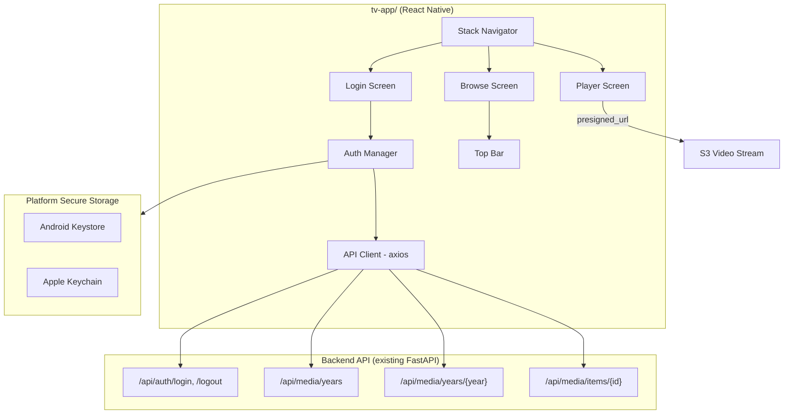
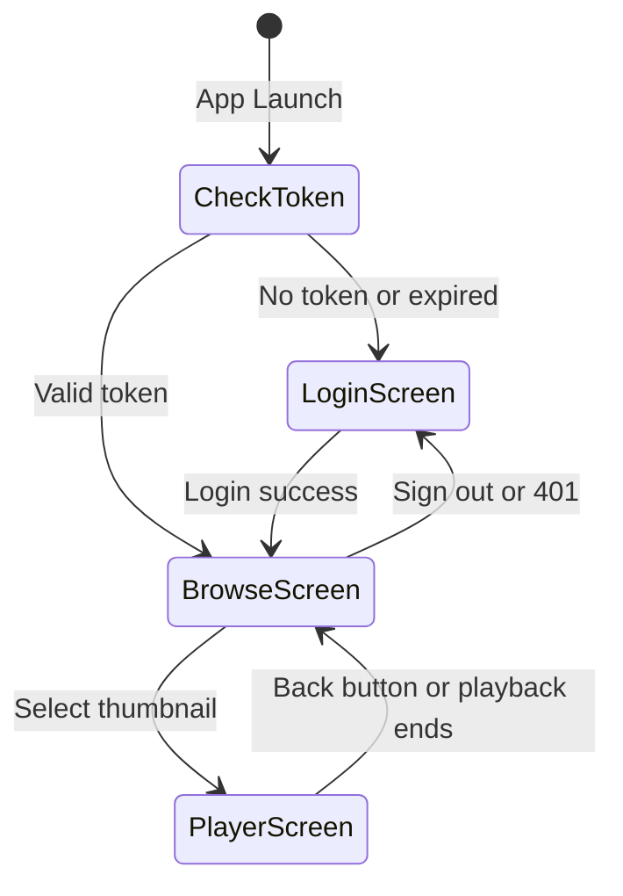

# Design Document: React Native TV App

## Overview

This design describes a React Native TV application (`tv-app/`) that provides a simplified, D-pad-only video browsing and playback experience targeting Android TV, Amazon Fire TV, and Apple TV. It connects to the existing FastAPI backend at `https://mw.mzwcms.com/api` using the same JWT authentication and media endpoints as the web frontend.

The TV app deliberately strips away the metadata panels, transcript views, sidebar navigation, and sort/filter controls present in the web frontend. It replaces them with a three-screen flow (Login → Browse → Player) optimized for older adults using a TV remote: large text, high contrast, and horizontal year-row browsing.

A small backend change is required: the existing `/api/auth/login` endpoint must accept an optional `client_type` field so the TV app can request a 30-day JWT instead of the default 24-hour token.

## Architecture



### Navigation Flow



### Key Architectural Decisions

| Decision | Choice | Rationale |
|---|---|---|
| Project location | `tv-app/` at workspace root | Separate from `frontend/` — different build toolchain (Metro vs Vite), different platform targets. Shared types via copy or symlink. |
| Apple TV framework | `react-native-tvos` | Fork of React Native with tvOS support baked in. The standard RN does not target tvOS. |
| Android TV / Fire TV | Standard React Native | React Native supports Android TV natively. Fire OS is Android-based, no special fork needed. |
| Secure token storage | `react-native-keychain` | Wraps Android Keystore and Apple Keychain. Avoids plaintext AsyncStorage. |
| HTTP client | `axios` | Same library as web frontend. Familiar interceptor pattern for Bearer injection and 401 handling. |
| Video playback | `react-native-video` | De facto standard for RN video. Supports streaming from presigned URLs on all TV platforms. |
| Navigation | `@react-navigation/native` + stack | Only 3 screens, no tabs needed. Stack navigator maps naturally to the TV back-button model. |
| Focus management | Built-in `TVFocusGuideView` + `Pressable` | React Native TV provides native focus engine integration. No third-party focus library needed. |
| State management | React Context + hooks | App state is minimal (auth token, year list, current media). No Redux/Zustand overhead warranted. |

## Components and Interfaces

### Screen Components

#### LoginScreen
- Two text inputs (username, password) and a "Sign In" button, laid out vertically
- D-pad navigates top-to-bottom: username → password → sign in
- On submit: calls `AuthManager.login(username, password, "tv")`
- Displays error text on 401: "Invalid username or password. Please try again."
- No Top_Bar visible

#### BrowseScreen
- Top_Bar at top (app name left, "Sign Out" button right)
- Vertical FlatList of `YearRow` components
- Each `YearRow`: year label + horizontal FlatList of `ThumbnailCard` components
- Lazy-loads year media on row visibility via `onViewableItemsChanged`
- Paginates horizontally: fetches next page when user scrolls near end of row
- "unknown_year" displayed as "Unknown Year", always rendered last
- Loading spinner while fetching years
- Error state with retry button if year fetch fails
- Back button prompts exit confirmation

#### PlayerScreen
- Full-screen `react-native-video` player
- Overlay: video title (28sp) shown first 5 seconds and when controls visible
- Transport controls: play/pause (select button), rewind 10s, forward 10s
- Back button stops playback, returns to BrowseScreen
- Playback completion auto-navigates to BrowseScreen
- Buffering spinner overlay
- Error state with retry button if presigned URL fails
- No metadata panel, no transcript panel

### Shared Components

#### TopBar
- Props: `onSignOut: () => void`
- Left: app name text (28sp)
- Right: "Sign Out" `Pressable` button, focusable
- Only rendered inside BrowseScreen

#### YearRow
- Props: `year: string`, `items: MediaItemSummary[]`, `loading: boolean`, `onEndReached: () => void`, `onSelectItem: (item: MediaItemSummary) => void`
- Year label (32sp) above horizontal FlatList
- Horizontal scroll with D-pad left/right focus movement
- Calls `onEndReached` when scrolled near end and more pages exist

#### ThumbnailCard
- Props: `item: MediaItemSummary`, `onSelect: () => void`
- Displays thumbnail image or placeholder SVG if `has_thumbnail` is false
- Title text below thumbnail (24sp)
- Focus indicator: 3dp border + 1.05x scale transform
- Minimum 48dp × 48dp touch target

#### ErrorOverlay
- Props: `message: string`, `onRetry: () => void`
- Centered error text (24sp) with focusable "Retry" button
- Reusable across all screens

#### LoadingSpinner
- Centered `ActivityIndicator` with "Loading..." text (24sp)
- Reusable across all screens

### Service Modules

#### AuthManager (`src/services/auth.ts`)

```typescript
interface AuthManager {
  login(username: string, password: string, clientType: string): Promise<void>;
  logout(): Promise<void>;
  getToken(): Promise<string | null>;
  isTokenValid(): Promise<boolean>;
  clearToken(): Promise<void>;
}
```

- `login`: POSTs to `/api/auth/login` with `{ username, password, client_type: "tv" }`, stores JWT via `react-native-keychain`
- `logout`: POSTs to `/api/auth/logout`, clears stored token
- `getToken`: reads from keychain
- `isTokenValid`: decodes JWT, checks `exp` claim against current time (no network call)
- `clearToken`: removes from keychain

#### ApiClient (`src/services/api.ts`)

```typescript
interface ApiClient {
  getYears(): Promise<YearsResponse>;
  getMediaByYear(year: string, page: number, pageSize: number): Promise<MediaListResponse>;
  getMediaItemDetail(id: string, year: string): Promise<MediaItemDetail>;
}
```

- axios instance with `baseURL: "https://mw.mzwcms.com/api"` and `timeout: 15000`
- Request interceptor: injects `Authorization: Bearer <token>` from AuthManager
- Response interceptor: on 401, calls `AuthManager.clearToken()` and triggers navigation to LoginScreen
- HTTPS only — no HTTP fallback

### Backend Change (Cross-Spec Dependency)

The existing `LoginRequest` in `app/api/auth/router.py` must be extended:

```python
class LoginRequest(BaseModel):
    username: str
    password: str
    client_type: str | None = None  # "tv" for 30-day token
```

And the `login` endpoint's token expiry logic:

```python
expiry = timedelta(days=30) if body.client_type == "tv" else timedelta(hours=24)
payload = {
    "sub": user.username,
    "iat": int(now.timestamp()),
    "exp": int((now + expiry).timestamp()),
}
```

This is ~5 lines changed. The field is optional with `None` default, so existing web frontend requests are unaffected.

## Data Models

The TV app shares type definitions compatible with the web frontend's `frontend/src/types/media.ts`. The TV app defines its own copy in `tv-app/src/types/media.ts` to avoid cross-project import complexity.

### Shared Types (compatible with web frontend)

```typescript
// tv-app/src/types/media.ts

export interface MediaItemSummary {
  id: string;
  title: string;
  year: string;
  upload_date: string;
  media_type: string;
  thumbnail_url: string | null;
  has_thumbnail: boolean;
}

export interface MediaItemDetail {
  id: string;
  title: string;
  year: string;
  media_type: string;
  presigned_url: string;
  thumbnail_url: string | null;
  metadata: null;       // TV app ignores metadata
  transcript: null;     // TV app ignores transcript
  transcript_available: boolean;
}

export interface MediaListResponse {
  items: MediaItemSummary[];
  page: number;
  page_size: number;
  total: number;
  next_page: number | null;
}

export interface YearsResponse {
  years: string[];
}

export interface LoginRequest {
  username: string;
  password: string;
  client_type: "tv";
}

export interface LoginResponse {
  token: string;
}
```

### TV-App-Specific Types

```typescript
// tv-app/src/types/navigation.ts

export type RootStackParamList = {
  Login: undefined;
  Browse: undefined;
  Player: { itemId: string; year: string };
};
```

```typescript
// tv-app/src/types/auth.ts

export interface DecodedJWT {
  sub: string;
  iat: number;
  exp: number;
}
```

### Year Display Mapping

The API returns `"unknown_year"` as a string. The TV app maps this for display:

```typescript
export function formatYearLabel(year: string): string {
  return year === "unknown_year" ? "Unknown Year" : year;
}
```

### Focus and Styling Constants

```typescript
// tv-app/src/theme/constants.ts

export const FONT_SIZE = {
  title: 32,    // Screen titles, year labels
  header: 28,   // Section headers, video title overlay
  body: 24,     // Body text, thumbnail titles, error messages
} as const;

export const FOCUS = {
  borderWidth: 3,
  scaleFactor: 1.05,
  minTargetSize: 48,
} as const;

export const COLORS = {
  background: "#121212",      // Dark background (luminance ~7%)
  surface: "#1E1E1E",         // Card/row background
  text: "#F5F5F5",            // Primary text (luminance ~96%)
  textSecondary: "#BDBDBD",   // Secondary text
  focusBorder: "#64B5F6",     // Focus ring color
  error: "#EF9A9A",           // Error text
  accent: "#90CAF9",          // Buttons, links
} as const;
```

## Correctness Properties

*A property is a characteristic or behavior that should hold true across all valid executions of a system — essentially, a formal statement about what the system should do. Properties serve as the bridge between human-readable specifications and machine-verifiable correctness guarantees.*

### Property 1: Token-based launch routing

*For any* JWT token state at app launch (no token, expired token, or valid token), the app should navigate to LoginScreen when the token is absent or expired, and to BrowseScreen when the token is present and not expired. Specifically, `isTokenValid()` returning `true` must route to Browse, and `false` must route to Login.

**Validates: Requirements 1.1, 1.10, 1.11**

### Property 2: Login stores token round-trip

*For any* valid username/password pair, after calling `AuthManager.login()`, calling `AuthManager.getToken()` should return a non-null JWT string, and decoding that JWT should yield a `sub` claim matching the username.

**Validates: Requirements 1.2**

### Property 3: Sign-out clears token

*For any* authenticated state where `AuthManager.getToken()` returns a non-null token, after calling `AuthManager.logout()`, `AuthManager.getToken()` should return null.

**Validates: Requirements 1.5, 5.4**

### Property 4: 401 response clears token

*For any* API request that returns a 401 status, the axios response interceptor should call `AuthManager.clearToken()`, resulting in `AuthManager.getToken()` returning null.

**Validates: Requirements 1.7**

### Property 5: Bearer token injection on all authenticated requests

*For any* API request made while a token is stored, the request's `Authorization` header should equal `"Bearer <token>"` where `<token>` is the value returned by `AuthManager.getToken()`.

**Validates: Requirements 1.8**

### Property 6: Backend client_type=tv yields 30-day token

*For any* login request with `client_type: "tv"`, the returned JWT's `exp` claim should be approximately 30 days (within a 60-second tolerance) after the `iat` claim. For any login request without `client_type`, the `exp` should be approximately 24 hours after `iat`.

**Validates: Requirements 1.12**

### Property 7: Year list renders correct count and order

*For any* list of years returned by the `/api/media/years` endpoint, the BrowseScreen should render exactly `years.length` YearRow components, and the rendered order should match the API response order (numeric descending, `unknown_year` last).

**Validates: Requirements 2.1**

### Property 8: Pagination appends items without loss

*For any* YearRow with existing items and a non-null `next_page`, fetching the next page should result in the items array length equaling the previous length plus the new page's item count, with all previous items preserved in order.

**Validates: Requirements 2.2, 2.3**

### Property 9: Loading state active during fetches

*For any* API fetch operation (years, media items, or media detail), the corresponding loading state should be `true` while the request is in-flight and `false` after it resolves or rejects.

**Validates: Requirements 2.6**

### Property 10: Placeholder rendered for missing thumbnails

*For any* `MediaItemSummary` where `has_thumbnail` is `false` or `thumbnail_url` is `null`, the ThumbnailCard component should render a placeholder element containing the item's title text instead of an `<Image>` element.

**Validates: Requirements 2.8**

### Property 11: Thumbnail selection fetches detail with correct parameters

*For any* `MediaItemSummary` with a given `id` and `year`, selecting that thumbnail should trigger a GET request to `/api/media/items/{id}?year={year}` with exactly those parameter values.

**Validates: Requirements 3.5, 4.1**

### Property 12: Play/pause toggle is an involution

*For any* playback state (playing or paused), pressing the select button should flip the state. Pressing select twice should return to the original state. Formally: `toggle(toggle(state)) === state`.

**Validates: Requirements 4.4**

### Property 13: Theme constants meet accessibility minimums

*For any* color pair (background, text) in the theme, the background luminance should be ≤ 20% and text luminance ≥ 80%. *For any* font size constant, body ≥ 24, header ≥ 28, title ≥ 32. *For any* interactive element size constant, width and height ≥ 48dp. *For any* focus indicator, border width ≥ 3dp and scale factor ≥ 1.05.

**Validates: Requirements 6.1, 6.2, 6.5, 6.6**

### Property 14: Type definition structural compatibility

*For any* field defined in the web frontend's `MediaItemSummary`, `MediaListResponse`, or `YearsResponse` interfaces, the TV app's corresponding interface should have a field with the same name and a compatible type (identical or a subtype).

**Validates: Requirements 7.5**

### Property 15: Retry re-attempts the failed request

*For any* failed API request followed by a retry action, the retry should issue a new request to the same endpoint with the same parameters, and the loading state should be `true` during the retry.

**Validates: Requirements 8.5**

### Property 16: Year label formatting

*For any* year string, `formatYearLabel(year)` should return `"Unknown Year"` if and only if the input is `"unknown_year"`, and should return the input unchanged for all other strings.

**Validates: Requirements 2.1**

## Error Handling

### Error Categories and Responses

| Error Condition | HTTP Status / Cause | User-Facing Message | Action |
|---|---|---|---|
| Invalid credentials | 401 from `/auth/login` | "Invalid username or password. Please try again." | Stay on LoginScreen, clear password field |
| Token expired (any endpoint) | 401 from any endpoint | (silent) | Clear token, navigate to LoginScreen |
| Network timeout / connection failure | axios `ECONNABORTED` or `ERR_NETWORK` | "Could not connect to the server. Check your internet connection and press OK to retry." | Show ErrorOverlay with retry button |
| Service unavailable | 503 from any endpoint | "The service is temporarily unavailable. Press OK to try again." | Show ErrorOverlay with retry button |
| Year list fetch failure | Any error from `/media/years` | "Could not load videos. Press OK to retry." | Show ErrorOverlay with retry on BrowseScreen |
| Video load failure | Presigned URL expired or player error | "Video could not be loaded. Press OK to retry." | Show ErrorOverlay, retry re-fetches media detail |
| Media page fetch failure | Error from `/media/years/{year}` | (silent) | Stop loading indicator, keep existing items, log error |

### Error Handling Strategy

- All error messages use minimum 24sp text with 4.5:1 contrast ratio
- Every error state with a user message includes a focusable retry button
- Retry buttons re-attempt the exact failed request and show a loading indicator during retry
- The axios response interceptor handles 401 globally — individual screens don't need to check for it
- Network errors and 503s are caught in the axios response interceptor and re-thrown with a normalized error type so screens can display the correct message
- Video player errors trigger a single automatic retry (re-fetch presigned URL) before showing the error overlay

### Error Type Normalization

```typescript
// tv-app/src/services/errors.ts

export type AppErrorKind = "network" | "unauthorized" | "unavailable" | "not_found" | "unknown";

export interface AppError {
  kind: AppErrorKind;
  message: string;
  retryable: boolean;
}

export function classifyError(error: unknown): AppError {
  if (axios.isAxiosError(error)) {
    if (!error.response) {
      return { kind: "network", message: "Could not connect to the server. Check your internet connection and press OK to retry.", retryable: true };
    }
    switch (error.response.status) {
      case 401: return { kind: "unauthorized", message: "", retryable: false };
      case 503: return { kind: "unavailable", message: "The service is temporarily unavailable. Press OK to try again.", retryable: true };
      case 404: return { kind: "not_found", message: "Content not found.", retryable: false };
      default:  return { kind: "unknown", message: "Something went wrong. Press OK to retry.", retryable: true };
    }
  }
  return { kind: "unknown", message: "Something went wrong. Press OK to retry.", retryable: true };
}
```

## Testing Strategy

### Dual Testing Approach

The TV app uses both unit tests and property-based tests for comprehensive coverage:

- **Unit tests**: Verify specific examples, edge cases, error conditions, and UI rendering snapshots
- **Property-based tests**: Verify universal properties across randomly generated inputs

### Property-Based Testing Configuration

- **Library**: [fast-check](https://github.com/dubzzz/fast-check) (TypeScript PBT library)
- **Test runner**: Jest (standard for React Native projects)
- **Minimum iterations**: 100 per property test
- **Each property test references its design property with a tag comment**
- **Tag format**: `Feature: react-native-tv-app, Property {N}: {title}`
- **Each correctness property is implemented by a single property-based test**

### Property Tests (fast-check)

| Property | Test Description | Generator Strategy |
|---|---|---|
| P1: Token-based launch routing | Generate random JWT payloads with exp in past/future/absent, verify routing decision | `fc.record({ exp: fc.option(fc.integer()) })` |
| P2: Login stores token round-trip | Generate random username strings, mock successful login, verify getToken returns JWT with matching sub | `fc.string()` for usernames |
| P3: Sign-out clears token | Generate random token strings, store them, call logout, verify getToken returns null | `fc.string()` |
| P4: 401 clears token | Generate random API paths, simulate 401 response, verify token cleared | `fc.string()` for paths |
| P5: Bearer token injection | Generate random token strings, make a request, verify Authorization header | `fc.string()` |
| P6: client_type=tv 30-day token | Generate random timestamps, create tokens with/without client_type, verify exp delta | `fc.integer()` for timestamps (backend test, Python hypothesis) |
| P7: Year list count and order | Generate random arrays of year strings, verify YearRow count matches | `fc.array(fc.oneof(fc.stringOf(fc.constantFrom('0','1','2','3','4','5','6','7','8','9')), fc.constant('unknown_year')))` |
| P8: Pagination appends | Generate random item arrays and page responses, verify concatenation preserves all items | `fc.array(fc.record(...))` |
| P9: Loading state during fetch | Generate random fetch durations, verify loading=true during and false after | `fc.nat()` |
| P10: Placeholder for missing thumbnails | Generate MediaItemSummary with has_thumbnail=false, verify placeholder rendered | `fc.record(...)` with `has_thumbnail: fc.constant(false)` |
| P11: Thumbnail select params | Generate random id/year pairs, verify fetch URL matches | `fc.record({ id: fc.string(), year: fc.string() })` |
| P12: Play/pause involution | Generate random boolean states, verify toggle(toggle(s)) === s | `fc.boolean()` |
| P13: Theme accessibility | Generate theme constant objects, verify all values meet minimums | `fc.record(...)` with constrained ranges |
| P14: Type compatibility | Structural check — enumerate fields from web types, verify TV types match | Static analysis, not randomized |
| P15: Retry re-attempts | Generate random error scenarios, trigger retry, verify same endpoint called again | `fc.record(...)` |
| P16: Year label formatting | Generate random strings, verify formatYearLabel behavior | `fc.string()` |

### Unit Tests (Jest)

| Test | Validates |
|---|---|
| Login with invalid credentials shows error message | Req 1.4 |
| API client baseURL is `https://mw.mzwcms.com/api` | Req 1.9 |
| Login request body includes `client_type: "tv"` | Req 1.13 |
| Year list error shows "Could not load videos" message with retry button | Req 2.7 |
| Back button on BrowseScreen shows exit confirmation | Req 3.6 |
| Back button on PlayerScreen navigates to BrowseScreen | Req 3.7 |
| Select on LoginScreen sign-in button submits credentials | Req 3.9 |
| PlayerScreen does not render metadata or transcript components | Req 4.6 |
| Video load error shows "Video could not be loaded" with retry | Req 4.7 |
| Playback completion navigates to BrowseScreen | Req 4.9 |
| TopBar visible on BrowseScreen, not on LoginScreen or PlayerScreen | Req 5.3 |
| Navigation stack has exactly 3 routes | Req 6.3 |
| Font family is sans-serif | Req 6.4 |
| Network error shows connection failure message | Req 8.1 |
| 503 error shows "service temporarily unavailable" message | Req 8.2 |
| API client timeout is 15000ms | Req 8.3 |

### Backend Property Test (Python / Hypothesis)

Property 6 (client_type=tv 30-day token) is tested on the backend side:

- **Library**: [hypothesis](https://hypothesis.readthedocs.io/)
- **Test file**: `tests/property/test_auth_client_type.py`
- **Tag**: `Feature: react-native-tv-app, Property 6: Backend client_type=tv yields 30-day token`
- **Strategy**: Generate random valid usernames, call the login endpoint with and without `client_type="tv"`, decode the JWT, verify `exp - iat` is within tolerance of 30 days or 24 hours respectively
